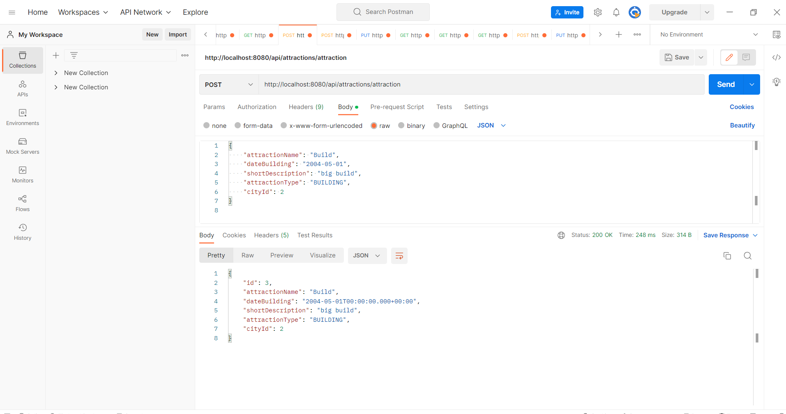
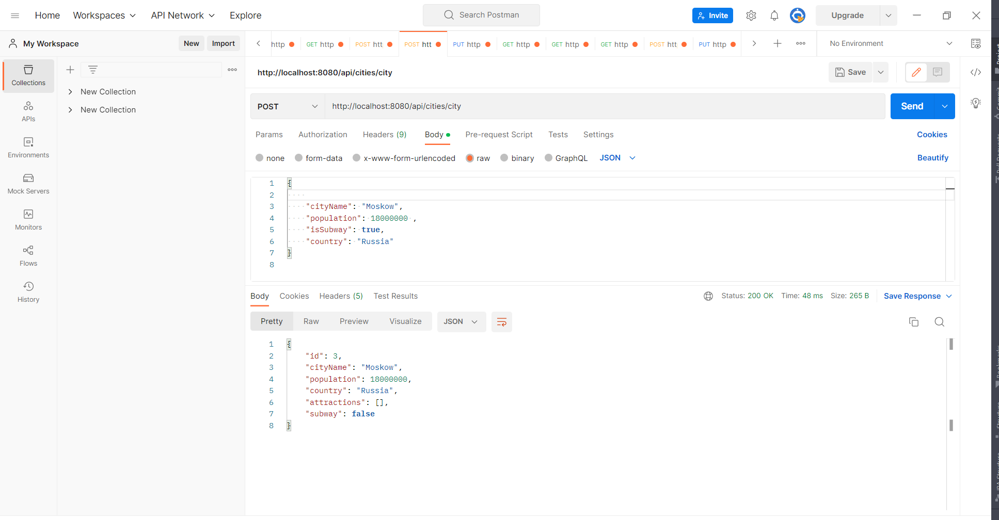
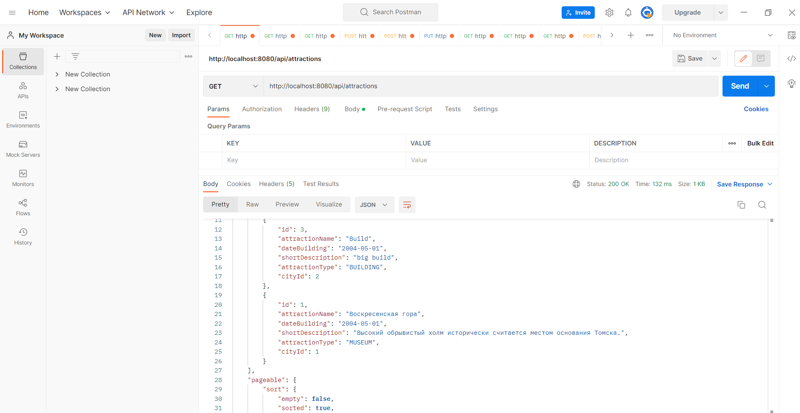
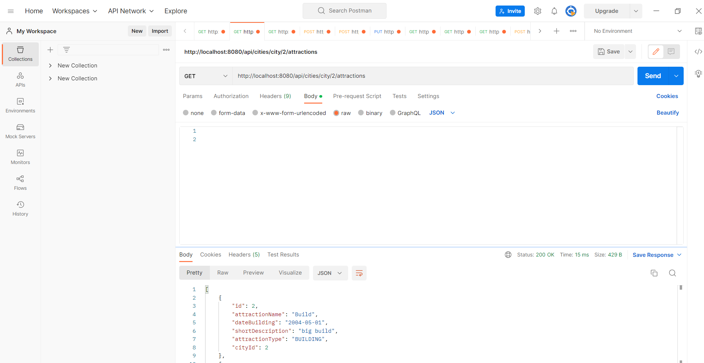

## REST service for storage data about cities attractions.

In application is using: Java 8, Spring Boot, Hibernate, PostgreSQL, Liquibase.

Service provides follow methods:
- get all attractions: GET - api/attractions;
- get all attractions in city: GET - api/cities/city/{id}/attractions;
- add city: POST - api/cities/city;
- add attraction: POST - api/attractions/attraction;
- change data by city: PUT - api/cities/city;
- change data by attraction: PUT - api/attractions/attraction;
- delete attraction: DELETE - api/attractions/{id}.

Launch application:

You can use next steps:

- clone repository to IDE - https://github.com/SergeyIvanov1/task-cities-attractions.git;
- in file application.properties need to specify settings for local database or launch docker container
  (for example: docker run --name cities_attractions -p 5433:5432 -e POSTGRES_USER=postgres -e 
POSTGRES_PASSWORD=1234 -e POSTGRES_DB=city_attractionsdb -d postgres:14);
- run application.

Several examples working of app:

Add attraction.

Add city.

Get all attractions.

Get attractions by city.
